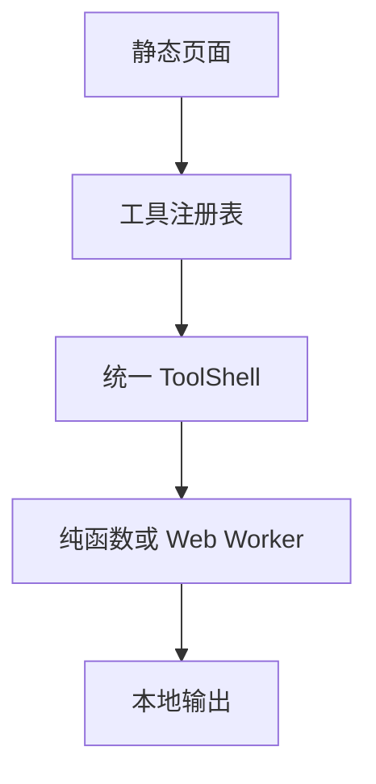

# Online Tools Hub 产品与技术设计文档

> 工作名称：Online Tools Hub  
> 推荐仓库名：`online-tools-hub`  
> 文档状态：Draft v1.1  
> 更新日期：2026-07-19

## 1. 项目摘要

Online Tools Hub 是一个面向开发者、学生和日常办公用户的综合在线工具站。首个版本聚焦 JSON 格式化、Base64 编解码等高频工具，并坚持三条核心原则：

1. **隐私优先**：能在浏览器本地完成的处理，绝不上传服务器。
2. **无需登录**：打开即用，不以账号、弹窗或广告阻碍主要任务。
3. **稳定一致**：所有工具使用统一交互方式、错误提示和质量标准。

一句话定位：**在浏览器里快速处理数据，内容不离开你的设备。**

## 2. 背景与问题

常见在线工具站往往存在以下问题：

- 页面广告、弹窗和无关内容过多；
- 用户无法判断输入内容是否被上传或记录；
- 同一站点内的工具交互不一致；
- 中文、Emoji、大整数或大文件等边界场景处理不可靠；
- 工具数量很多，但缺少测试、说明和长期维护。

本项目不追求首日拥有最多工具，而是先把少量高频工具做到可信、快速、可验证，再通过统一框架持续扩展。

## 3. 产品目标

### 3.1 目标

- 已提供 5 个稳定的 MVP 文本工具，并在 0.4.0 加入第 6 个本地图片工具；
- 每个工具均支持移动端、键盘操作、复制、下载和清空；
- 明确展示“本地处理”或“需要联网”，不让用户猜测数据流向；
- 建立可复用的工具注册、页面外壳、测试和发布机制；
- 采用静态部署，优先支持 GitHub Pages，并保留迁移到其他平台的能力。

### 3.2 非目标

MVP 不包含：

- 账号、会员、云端历史记录和跨设备同步；
- AI 生成、在线代码执行或远程 URL 抓取；
- 密码保险箱、密钥托管或声称提供安全加密；
- 大型音视频、PDF 或需要服务端资源的文件转换；
- 依赖第三方接口的天气、IP、DNS 等联网工具；
- 用户输入分享链接，因为这会让敏感内容进入 URL、日志或浏览器历史。

## 4. 目标用户与核心场景

| 用户 | 典型需求 | 成功标准 |
|---|---|---|
| 开发者 | 临时检查 API JSON、时间戳、URL 参数 | 10 秒内完成，错误位置清楚 |
| 学生与初学者 | 理解编码结果、验证格式 | 有简短说明、示例和安全提示 |
| 测试与运维人员 | 生成 UUID、查看结构化数据 | 支持批量复制与下载 |
| 办公用户 | 转换文本或比较内容 | 无需安装软件或登录 |

## 5. 产品原则

### 5.1 本地优先

- 用户输入默认只存在于当前页面内存；
- 不写入 URL、日志、Cookie、LocalStorage、SessionStorage 或 IndexedDB；
- 不自动读取剪贴板；复制、下载等操作必须由用户主动触发；
- 清空时同时释放输入、输出、错误状态和临时 Blob URL；
- 如果未来加入联网工具，必须单独标记，并在请求前说明接收数据的服务方。

### 5.2 一个页面解决一个任务

每个工具页只围绕一个明确任务设计。相关能力可以作为选项存在，但不创建难以理解的“万能转换器”。

### 5.3 错误必须可操作

错误提示应说明发生了什么、出现在哪里、用户下一步可以怎么做。错误不能只用红色表达，也不能仅返回“转换失败”。

### 5.4 候选功能不是承诺

路线图中的 Milestone 2、Milestone 3 只是候选范围。只有进入具体里程碑的功能才视为已承诺开发。

## 6. 信息架构

### 6.1 页面结构

| 页面 | 路径示例 | 主要内容 |
|---|---|---|
| 首页 | `/` | 搜索、常用工具、分类、隐私承诺 |
| 工具目录 | `/tools` | 全部工具、分类和筛选 |
| 工具详情 | `/tools/json-formatter` | 输入、输出、操作、说明、FAQ |
| 分类页 | `/categories/encode-decode` | 同类工具集合 |
| 隐私说明 | `/privacy` | 数据处理原则和联网边界 |
| 关于项目 | `/about` | 项目定位、开源地址和贡献方式 |
| 更新日志 | `/changelog` | 新工具、修复和行为变更 |

表中路径是站内逻辑路由。使用默认 GitHub Pages 项目站部署时，公开地址带有 `/online-tools-hub` 前缀，例如 `/online-tools-hub/tools/json-formatter/`。代码不得手写部署前缀；内部链接、静态资源、Worker、canonical、sitemap、manifest 和 PWA scope 必须统一通过 base-aware URL helper 生成。迁移到自定义域名后，只需更改站点配置，不逐页改链接。

### 6.2 工具分类

- 格式化与校验
- 编码与解码
- 文本处理
- 时间与标识符
- 安全与哈希
- 文件与图片
- 网络查询（后续，需明确联网）

## 7. MVP 范围

MVP 的 5 个核心文本工具已经完成验收。0.4.0 依照新工具准入规则加入第 6 个工具“图片压缩与格式转换”，仍保持无后端依赖和本地优先。

| 优先级 | 工具 | 核心能力 | 关键边界 |
|---:|---|---|---|
| P0 | JSON 格式化与校验 | 格式化、压缩、校验、缩进选择 | 错误行列、大整数、转义字符 |
| P0 | Base64 编解码 | 文本编码、文本解码、标准/URL-safe 模式 | UTF-8、中文、Emoji、非法填充 |
| P0 | URL 编解码 | 编码/解码组件与完整 URL | 防止错误使用两种编码模式 |
| P1 | Unix 时间戳转换 | 秒/毫秒识别、本地与 UTC 时间 | 时区、负数、无效日期 |
| P1 | UUID 生成 | UUID v4、批量生成、复制 | 必须使用安全随机源 |

### 7.1 JSON 格式化与校验

必须支持：

- 2 空格、4 空格和 Tab 缩进；
- 压缩为单行；
- 错误定位到行和列，并显示附近上下文；
- 展示输入大小、有效状态和处理耗时；
- 复制或下载 `.json` 文件；
- 示例数据一键填充。

特别要求：不得使用 `eval`、`Function` 或 `innerHTML` 处理用户内容。对于超过 JavaScript 安全整数范围的数字，格式化过程不得静默改变值；应采用保留数字词法的方案，或在无法保证时阻止转换并给出明确警告。

### 7.2 Base64 编解码

必须支持：

- UTF-8 文本正确往返；
- 中文、Emoji、换行和空字符测试；
- 标准 Base64 与 Base64URL 切换；
- 非法字符、错误填充和无效 UTF-8 提示；
- 一键交换输入与输出；
- 复制结果和下载文本。

页面必须醒目标注：**Base64 是编码，不是加密，不能用于保护密码或机密信息。**

### 7.3 URL 编解码

必须区分：

- URL 组件：使用组件级编码；
- 完整 URL：保留协议和结构字符；
- `+` 与空格的表单编码差异。

工具不主动访问用户输入的 URL。

### 7.4 Unix 时间戳转换

必须支持：

- 自动识别秒与毫秒，并允许手动覆盖；
- 输出本地时间、UTC 和 ISO 8601；
- 选择日期后反向生成时间戳；
- 明确显示当前时区；
- 处理 1970 年前日期和越界值。

### 7.5 UUID 生成

必须支持：

- 生成一个或批量生成 UUID v4；
- 用户可设置数量，但有合理上限；
- 使用 `crypto.randomUUID()` 或等价的密码学安全随机源；
- 复制单项、复制全部和下载。

### 7.6 图片压缩与格式转换

必须支持：

- 批量选择或拖放 JPEG、PNG、WebP，严格按文件签名识别；
- 质量、输出格式和最长边设置，并展示压缩前后体积与节省比例；
- PNG 在同源 Worker 中做本地调色板量化，JPEG/WebP 使用浏览器编码器；
- 单张下载与本地生成 ZIP 批量下载；
- 单文件最多 20 MiB、最多 20 个文件、总计 100 MiB，按队列串行处理；
- 拒绝 APNG、动画 WebP 及不支持格式，避免静默丢失动画帧；
- 输入、文件名与输出不写入 URL 或持久化存储，临时 Blob URL 在删除、清空和卸载时释放；
- 画布重编码会移除大多数图片元数据；不同浏览器和图片内容的压缩结果可能不同，不宣称使用或复现 TinyPNG 的商业算法。

## 8. 统一交互设计

### 8.1 工具页布局

桌面端使用左右双栏，移动端切换为上下布局：

1. 标题、用途说明和“本地处理”状态；
2. 输入区；
3. 主操作和常用选项；
4. 输出区；
5. 复制、下载、交换、清空；
6. 错误详情、使用说明和 FAQ。

### 8.2 共用操作

所有适用工具保持同一顺序和命名：

- 执行
- 复制结果
- 下载
- 交换
- 清空
- 填入示例

复制成功使用非阻塞提示；错误信息保留在相关输入附近。危险或不可逆操作不使用模糊图标代替文字。

### 8.3 视觉方向

- 风格：干净、专业、轻量，不模仿虚假终端界面；
- 颜色：中性色为基础，蓝紫色用于主要操作，青绿色用于“本地处理”状态；
- 同时支持浅色与深色主题；
- 正文、按钮和状态颜色达到 WCAG AA 对比度；
- 360 px 宽度下无横向溢出；
- 动效尊重 `prefers-reduced-motion`。

### 8.4 无障碍

- 所有操作可通过键盘完成；
- 输入、选项、错误和输出均有可读标签；
- 焦点状态明显且顺序符合视觉顺序；
- 动态结果通过合适的 live region 通知，但避免重复播报；
- 错误不能只依赖颜色或图标表达。

## 9. 技术方案

### 9.1 推荐技术栈

| 层级 | 选择 | 原因 |
|---|---|---|
| 应用框架 | Astro + React + TypeScript | 静态页面负责 SEO，React Island 负责工具交互，默认 JavaScript 更少 |
| 部署模式 | Astro Static Build | MVP 无后端，可直接部署到 GitHub Pages |
| 样式 | Tailwind CSS + CSS Variables | 快速建立统一设计令牌与主题 |
| 表单与状态 | React 内置状态为主 | 避免在 MVP 引入全局状态依赖 |
| 核心逻辑 | 独立 TypeScript 纯函数 | 便于单元测试和跨 UI 复用 |
| 大任务 | Web Worker | 避免大文本处理阻塞主线程 |
| PNG 压缩 | `@upng/upng-js` 2.2.2 | 纯 JavaScript 调色板量化；随站点打包，不在运行时请求 CDN |
| 单元测试 | Vitest | 覆盖转换器、校验器和边界输入 |
| 端到端测试 | Playwright | 验证真实浏览器交互和无网络承诺 |

不从公共 CDN 动态加载运行时代码。依赖使用锁文件固定，并通过自动化更新与审计控制风险。

部署实现以 [Astro 的 GitHub Pages 官方指南](https://docs.astro.build/en/guides/deploy/github/) 和 [GitHub Pages 自定义工作流文档](https://docs.github.com/en/pages/getting-started-with-github-pages/using-custom-workflows-with-github-pages) 为准，避免复制来源不明或已经过时的工作流模板。

默认项目站必须配置：

```ts
// astro.config.mjs
import { defineConfig } from "astro/config";

export default defineConfig({
  site: "https://oracle0703.github.io",
  base: "/online-tools-hub",
});
```

如果将来绑定自定义域名，则把 `site` 改为完整自定义域名并移除 `base`。构建测试必须同时验证主页、直接访问工具页、静态资源和 Worker URL。

### 9.2 运行架构



MVP 转换流程不经过应用服务器。构建和部署可以联网，用户处理内容时不需要联网。

### 9.3 工具注册模型

每个工具通过统一清单注册，首页、目录、搜索、路由和 SEO 元数据均从清单生成，避免新增工具时修改多个位置。

建议字段：

```ts
type ToolDefinition = {
  id: string;
  slug: string;
  category: string;
  title: string;
  description: string;
  keywords: string[];
  privacyMode: "local" | "network";
  load: () => Promise<unknown>;
  limits: {
    maxTextBytes?: number;
    maxFileBytes?: number;
  };
};
```

工具组件按路由懒加载，避免所有转换库进入首页资源。

静态构建下，`src/pages/tools/[slug].astro` 必须从工具注册表导出 `getStaticPaths()`，为每个已启用工具生成页面；`src/pages/categories/[slug].astro` 同样从分类清单生成。未知或未启用的 slug 不进入构建清单，直接落入静态 404 页面。工具注册测试必须检查 slug 唯一、分类存在、路由可生成。

### 9.4 建议目录

```text
online-tools-hub/
├── src/
│   ├── pages/
│   │   ├── tools/
│   │   │   ├── index.astro
│   │   │   └── [slug].astro
│   │   ├── categories/
│   │   │   └── [slug].astro
│   │   ├── privacy.astro
│   │   ├── about.astro
│   │   ├── changelog.astro
│   │   ├── 404.astro
│   │   └── index.astro
│   ├── layouts/
│   ├── components/
│   │   ├── tool-shell/
│   │   └── ui/
│   ├── tools/
│   │   ├── json-formatter/
│   │   ├── base64/
│   │   ├── url-codec/
│   │   ├── timestamp/
│   │   └── uuid/
│   ├── lib/
│   │   ├── tool-registry.ts
│   │   └── privacy.ts
│   ├── i18n/
│   └── workers/
├── public/
├── tests/
│   ├── e2e/
│   └── fixtures/
├── docs/
│   ├── PROJECT_PLAN.md
│   └── decisions/
├── .github/
│   └── workflows/
├── astro.config.mjs
├── package.json
└── README.md
```

## 10. 性能、容量与安全边界

### 10.1 默认限制

| 项目 | MVP 建议值 | 行为 |
|---|---:|---|
| 文本输入 | 2 MiB | 超限时拒绝处理并说明原因 |
| 图片文件输入 | 单文件 20 MiB、最多 20 个、总计 100 MiB | 超限时拒绝；串行处理并限制解码尺寸 |
| UUID 批量数量 | 1,000 | 超限时提示用户分批生成 |
| 主线程任务 | 50 ms 以内 | 超出时迁移到 Worker 或分片处理 |

限制应集中配置，界面提前显示，而不是处理失败后才告知。

### 10.2 安全要求

- 用户内容只按纯文本渲染，禁止未经净化的 HTML 注入；
- 使用 hash-based CSP，不允许 `unsafe-eval`；
- Markdown 预览等高风险工具进入后续阶段前必须单独威胁建模；
- 正则工具必须防范 ReDoS，优先使用 Worker、超时和输入限制；
- JWT 工具未来只能命名为“JWT 查看器/解析器”，并提示“解码不代表签名有效”；
- 哈希工具优先提供 SHA-256/SHA-512；MD5 若因兼容性加入，必须标注不适合安全用途；
- 第三方依赖保持最少，固定版本并检查供应链风险；
- 分析统计不得采集输入、输出、剪贴板内容、文件名或错误上下文。

### 10.3 GitHub Pages 上的 CSP

GitHub Pages 无法为项目自定义完整响应头，因此 MVP 使用 Astro `security.csp` 在构建时生成带哈希的 `<meta http-equiv="content-security-policy">`。基线至少包含：

- `default-src 'self'`；
- `connect-src 'none'`；
- `object-src 'none'`；
- `base-uri 'self'`；
- `img-src 'self' data: blob:`；
- `worker-src 'self'`；
- Astro 为实际脚本和样式生成的 hash；
- 明确禁止 `unsafe-eval`。

该策略必须针对生产构建产物测试，确保工具、Worker、复制和下载仍可工作。`meta` 方式不支持全部 CSP 能力，因此 `frame-ancestors`、报告模式等只能在支持自定义响应头的托管平台上作为后续加固项，不能在 GitHub Pages 阶段宣称已经实现。

## 11. SEO、国际化与内容

### 11.1 SEO

每个工具页应包含：

- 独立标题和描述；
- canonical URL；
- Open Graph 信息；
- 可索引的用途说明、示例和 FAQ；
- 面包屑与相关工具链接；
- 自动生成的 sitemap 和正确的 robots 配置。

用户输入永远不进入查询参数、页面元数据或分享链接。

### 11.2 国际化

MVP 先完整提供中文内容。代码和路由从第一天预留国际化能力，但只有在全部核心页面和工具说明完成翻译后才启用 `/en/...`。不发布中文、英文混杂的半成品页面。

### 11.3 内容模板

每个工具页固定包含：

1. 这个工具做什么；
2. 数据是否离开设备；
3. 三步使用方法；
4. 至少两个可验证示例；
5. 边界与安全提醒；
6. 常见问题；
7. 相关工具。

## 12. 质量与验收标准

### 12.1 功能验收

- 5 个 MVP 工具和图片压缩工具均完成并通过验收；
- 页面加载完成后，执行所有工具操作产生的出站请求数量为 0；
- Playwright 使用唯一 canary 输入验证原文及其 Base64、URL 编码和 SHA-256 表示均未外传；
- canary 不得出现在当前 URL、history state、Cookie、LocalStorage、SessionStorage、IndexedDB、console 或 error 日志中；
- 每个核心转换器至少包含 20 个测试向量；
- 核心转换逻辑覆盖率不低于 80%；
- JSON 无效输入能显示行、列和附近上下文；
- JSON 大整数不会被静默改写；
- Base64 通过常见 RFC 4648 测试向量，并正确往返中文和 Emoji；
- 注入测试字符串只作为文本显示，不执行脚本；
- 1 MiB 文本在支持设备上目标为 1 秒内完成，期间界面保持可响应；
- 刷新工具页不会恢复上一次用户输入。

### 12.2 体验与性能验收

- Lighthouse 移动端 Performance、Accessibility、Best Practices、SEO 均达到 90 分以上；
- axe 自动检查无 serious 或 critical 问题；
- 360 px 宽度无横向溢出；
- 首屏 gzip 资源目标不超过 200 KiB；
- 单个工具新增的 gzip JavaScript 目标不超过 100 KiB；
- CI 在锁定版本的 Chromium、Firefox、WebKit 上通过核心流程；
- 每次候选发布在真实 Edge/Windows 与 Safari/macOS 上执行手动或浏览器云冒烟测试，并记录结果。Playwright WebKit 不等同于真实 Safari。

### 12.3 CI 分层

为减少无效等待，同时守住质量门槛：

| 触发条件 | 检查 |
|---|---|
| Draft PR | 格式、Lint、类型检查、单元测试、构建 |
| Ready PR | Draft 检查 + Playwright Chromium/Firefox/WebKit 核心流程 |
| `main` | 全量检查 + 静态部署 |
| 候选发布预检 | 真实 Edge/Windows、Safari/macOS + Lighthouse |

缺陷等级与工具优先级分开命名：`Sev-0` 表示数据泄露、数据被静默破坏或站点不可用；`Sev-1` 表示核心工具无法完成主要任务、严重无障碍阻断或主流浏览器关键流程失败。其余问题按 `Sev-2/Sev-3` 管理。

## 13. 路线图

### Milestone 0：项目基础

- 初始化仓库、许可证、贡献规范和 Issue 模板；
- 建立 Astro 静态构建、React Island、设计令牌和基础页面；
- 建立工具注册表、`ToolShell` 和统一错误模型；
- 配置单元测试、浏览器测试和分层 CI；
- 发布隐私说明。

完成条件：空工具模板可注册、构建、测试并部署到 GitHub Pages。

### Milestone 1：MVP 工具

- JSON 格式化与校验；
- Base64 编解码；
- URL 编解码；
- Unix 时间戳转换；
- UUID v4 生成；
- 搜索、分类、复制、下载、清空和示例共用能力。

完成条件：全部通过第 12 节验收，并在 RC 或公开 beta 部署后的连续 14 天观察期内没有未解决的 `Sev-0/Sev-1` 问题。

### 0.4.0：本地图片工具

- 图片压缩与 JPEG、PNG、WebP 格式转换；
- 批量队列、质量与尺寸控制、单张与 ZIP 下载；
- 移动端、SEO、无障碍、隐私 canary 与三浏览器验证。

完成条件：用户处理图片时不产生出站请求或持久化，动画与超限输入明确拒绝，核心算法、移动端布局和下载流程均通过自动化测试。

### Milestone 2：体验增强

候选能力：

- 收藏常用工具，仅保存工具 ID；
- PWA 离线使用和安装；
- 文本 Diff；
- SHA-256/SHA-512 与文件哈希；
- 查询参数解析；
- CSV 与 JSON 转换；
- JWT 查看器；
- 完整英文版本。

启动条件：MVP 稳定，并且候选工具获得至少 3 条独立用户需求或 Issue 投票。

### Milestone 3：受控扩展

候选能力：

- Markdown 安全预览；
- 正则测试；
- 二维码生成与读取；
- 明确标注的联网查询工具。

每项功能在进入开发前，都需要单独评估性能、隐私、安全和维护成本。

## 14. 新工具准入规则

新工具进入开发前必须同时满足：

1. 用户任务清楚，不能只用“可能有人需要”作为理由；
2. 已确认本地处理或明确设计联网边界；
3. 有输入限制、错误模型和测试向量；
4. 可以复用工具注册表与 `ToolShell`；
5. 不引入在线代码执行、远程抓取等高风险能力；
6. 不显著增加所有页面的首屏资源；
7. 有负责人维护依赖、文案和测试。

建议用以下维度打分：使用频率、纯前端可行性、实现复杂度、隐私风险、长期维护成本。低风险、高频、易验证的工具优先。

## 15. 数据统计原则

MVP 可以不接入统计。未来如需了解产品使用情况，只允许记录：

- 页面访问数量；
- 工具 ID；
- 操作类型，例如点击“复制”或“下载”；
- 性能区间和匿名错误类型。

严禁记录：用户输入、输出、文件内容、文件名、剪贴板、完整错误上下文、可识别个人身份的信息。

## 16. 主要风险与缓解措施

| 风险 | 影响 | 缓解措施 |
|---|---|---|
| 工具数量快速膨胀 | 质量下降、维护失控 | MVP 限制 5 个工具，执行准入规则 |
| 大文本阻塞页面 | 页面卡死或崩溃 | 输入上限、Worker、分片与耗时指标 |
| JSON 大整数被修改 | 用户数据错误 | 保留词法或明确阻止并警告 |
| 用户误认 Base64 为加密 | 泄露敏感信息 | 页面醒目标注并在示例中解释 |
| 用户内容被脚本执行 | XSS | 纯文本渲染、CSP、注入测试 |
| 第三方依赖过多 | 性能和供应链风险 | 减少依赖、锁版本、自动审计 |
| GitHub Pages 路径差异 | 刷新或资源路径 404 | 配置 `site`/`base`，使用 base-aware helper，并在 CI 验证部署 URL |
| 中英文内容不完整 | SEO 重复、体验割裂 | 仅在完整翻译后开放英文路由 |

## 17. 首批 GitHub Issues 建议

| Issue | 标题 | 依赖 |
|---:|---|---|
| 1 | 初始化 Astro 静态站点与 GitHub Pages | 无 |
| 2 | 建立设计令牌、主题与响应式布局 | #1 |
| 3 | 实现工具注册表与 ToolShell | #1, #2 |
| 4 | 发布隐私说明与本地处理标识 | #2 |
| 5 | 实现 JSON 格式化与校验 | #3 |
| 6 | 实现 Base64 编解码 | #3 |
| 7 | 实现 URL 编解码 | #3 |
| 8 | 实现时间戳转换 | #3 |
| 9 | 实现 UUID v4 生成 | #3 |
| 10 | 配置分层 CI、Playwright 与 Lighthouse | #1 |
| 11 | 建立工具目录、搜索与分类 | #3, #5-#9 |
| 12 | 完成 MVP 无障碍、安全与发布验收 | #4-#11 |

## 18. 发布清单

- [ ] 5 个 MVP 工具与图片压缩工具全部通过功能测试；
- [ ] GitHub Pages 生产链接可访问，刷新子路由不出现 404；
- [ ] 隐私页准确说明本地处理与未来联网工具边界；
- [ ] Base64 页面说明“编码不是加密”；
- [ ] JSON 大整数和错误行列测试通过；
- [ ] 用户输入不会持久化或进入 URL；
- [ ] 移动端、键盘和屏幕阅读器核心流程可用；
- [ ] Sitemap、robots、canonical 和社交分享元数据正确；
- [ ] README 包含本地开发、测试、构建和部署方法；
- [ ] CI 状态为绿色；
- [ ] 更新日志记录首次发布范围和已知限制。

## 19. 最终决策摘要

- 项目从新的独立仓库开始，不并入现有个人网站仓库；
- MVP 是隐私优先、无登录、无后端的静态工具站；
- 首版完成 JSON、Base64、URL、时间戳、UUID 五个 MVP 工具；0.4.0 依照准入规则加入本地图片压缩与格式转换；
- 所有转换逻辑在浏览器本地执行，并通过自动化测试验证隐私承诺；
- 使用统一工具注册表和 `ToolShell` 控制长期扩展成本；
- 先发布完整中文版本，英文版本完成后再开放独立路由；
- 优先通过 GitHub Pages 部署，并用分层 CI 控制质量和浏览器测试成本。
